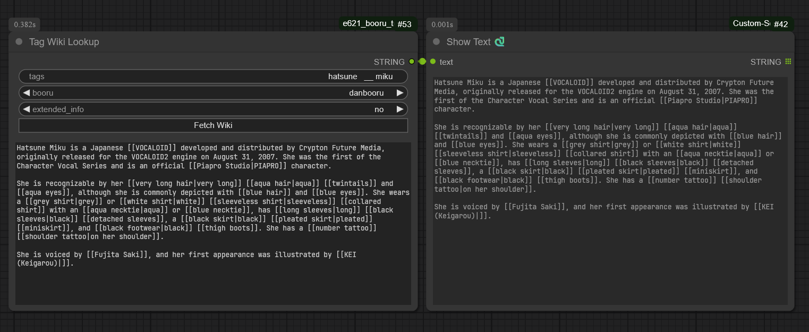

# ComfyUI e621 booru Toolkit

### Nodes

##### Fetch e621/Booru Post node
Gets the image, tags and original + scaled image dimensions from a given danbooru or e621 post url.

`url`: insert any post url from e621 or danbooru (see Supported sites at the bottom)
`scale_target_avg`: determines what average to scale the image dimensions to. SCALED_WIDTH and SCALED_HEIGHT will then output diffusion-compatible values by keeping the numbers multiples of 64. (e.g.: Use ~1024 for SDXL)
`img_size`: set the size variant of the output image (sizes are in danbooru format, if you select a size unsupported by e621 it will use `preview` as fallback)
`format_tags`: if set to `true` the output will format the tags to remove any underscores and adds backslashes infront of parenthesis
`exclude_tags`: excludes tags based on bottom textbox

##### Tag Wiki Lookup node
Gets the wiki description of a given tag. Output is pretty barebones but it's probably enough for most people. Can be used standalone through the Fetch Wiki button (I wanted to make the output show as markdown like the Markdown Note node but me JS skills are like none)

`tags`: input any tag you want to get the wiki description of
`booru`: select what image board site you want to get the info from
`extended_info`: more of an experimental setting but for danbooru at least it gets rid of related tags and such that is below that
`Fetch Wiki Button`: You don't have to queue to get the wiki description. Since nothing is queued, it will only show the text in a read-only textbox in the node

#### Supported sites
(Note: there may be NSFW content if you visit these)

- [Danbooru](https://danbooru.donmai.us)
- [e621](https://e621.net/) / [e926](https://e926.net/) / [e6ai](https://e6ai.net)

##### Useful nodes:

Show Text node and tag autocomplete as well as other possibly useful stuff from [ComfyUI-Custom-Scripts](https://github.com/pythongosssss/ComfyUI-Custom-Scripts)
Show Any node from [ComfyUI-Easy-Use](https://github.com/yolain/ComfyUI-Easy-Use)

this repo is originally a rewrite of: https://github.com/yffyhk/comfyui_auto_danbooru
